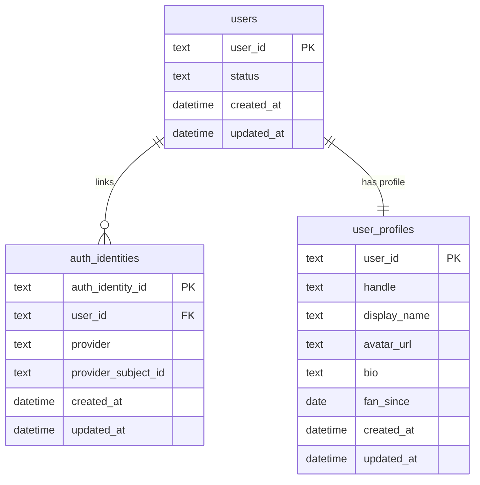
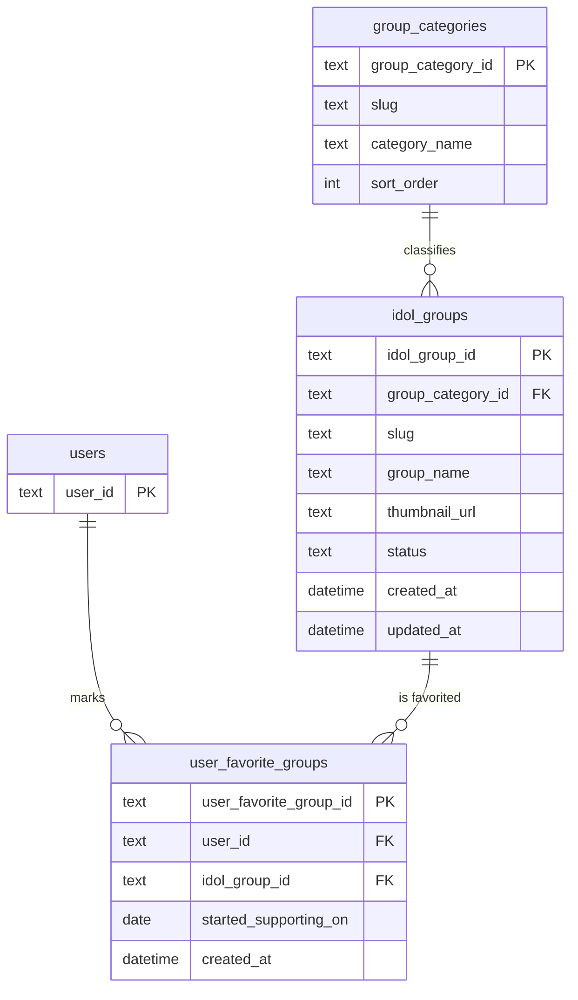
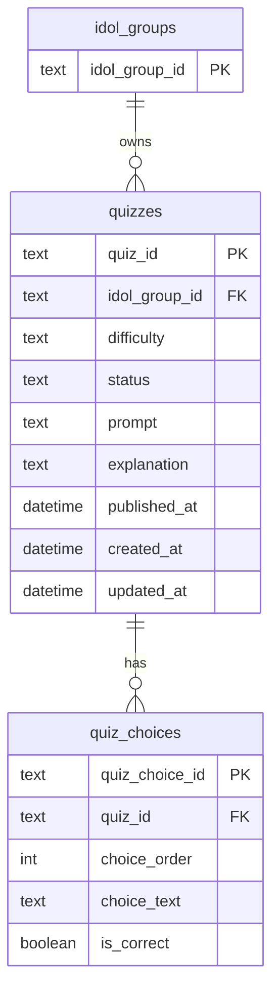
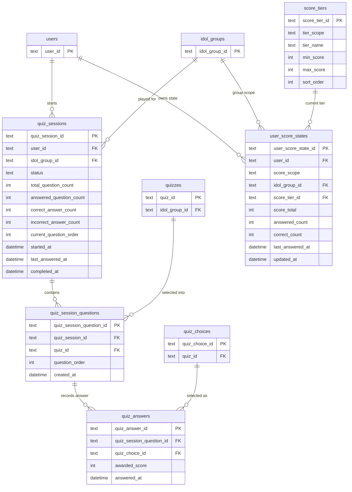
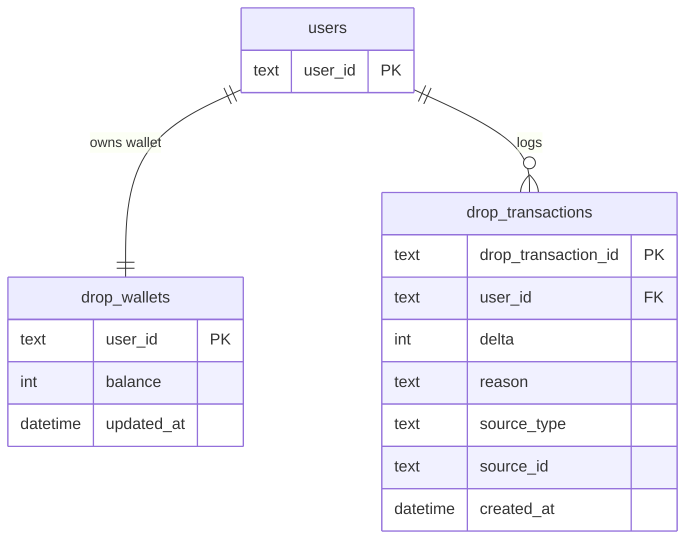
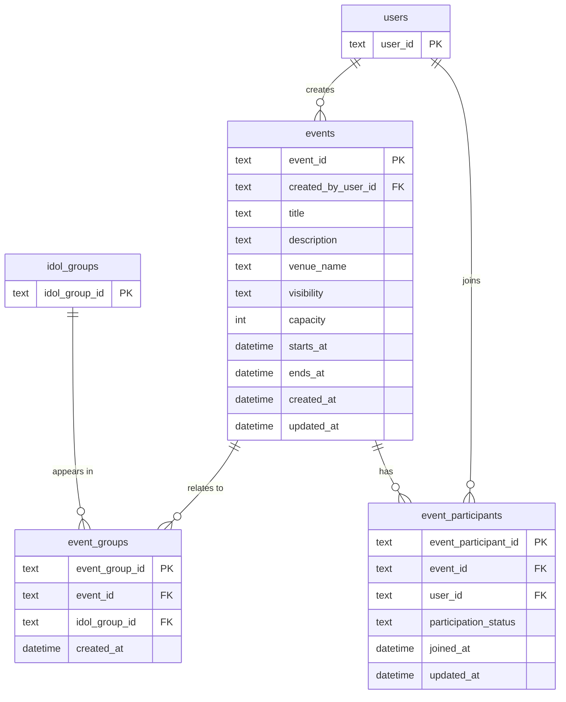
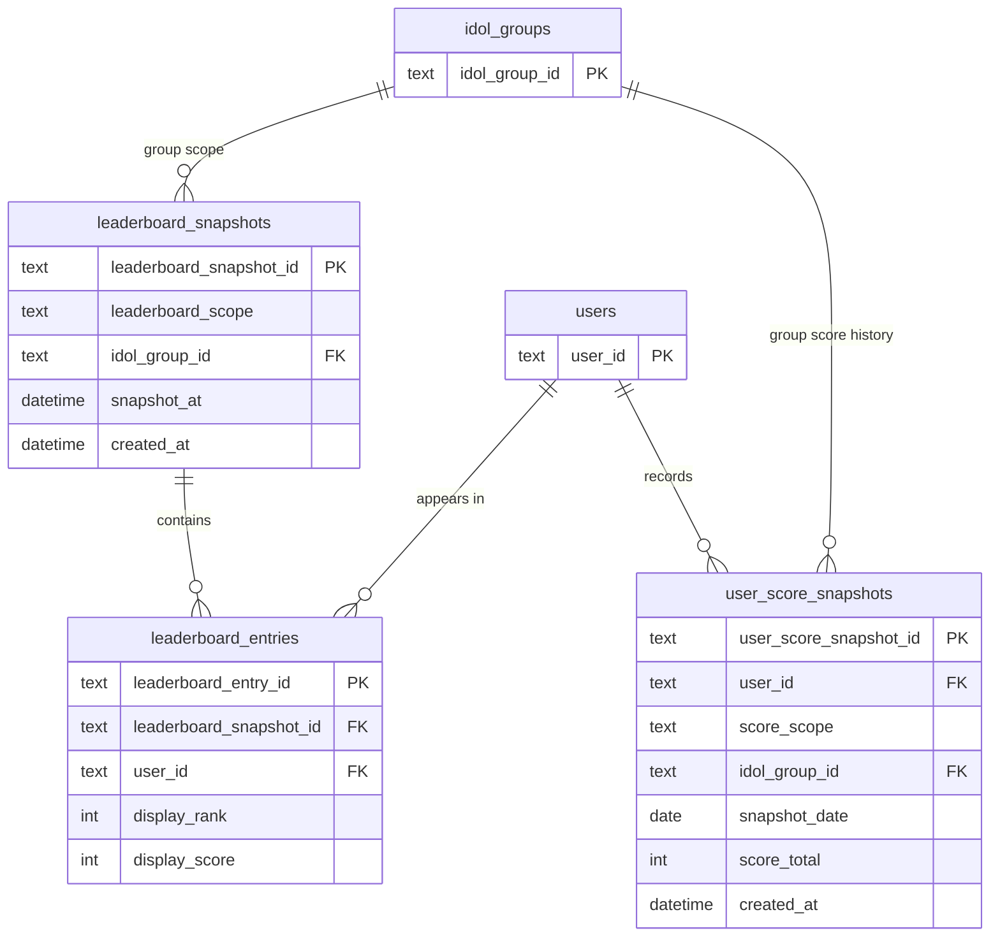

# K-Drop v2 ER Design

## この文書の前提

- v2 は Cloudflare D1 を前提にした論理スキーマです。
- 認証基盤は特定のプロダクトに固定せず、アプリ側との境界だけを表現します。
- アプリ固有の ID は `text` を前提にします。実装では ULID などの衝突しにくい文字列 ID を想定します。
- `datetime` は UTC の ISO8601 文字列で保存する前提です。
- 集計結果と元データを分けます。元データを source of truth にし、ランキングや履歴は read model として扱います。

## この再設計で整理したこと

- `app_users` のような認証依存の列はやめて、認証基盤と `users` / `auth_identities` の境界を明確にします。
- クイズは `quiz_sessions` / `quiz_session_questions` / `quiz_answers` に分け、開始・進行・完了をバックエンドで管理します。
- `selected_choice` のような曖昧な整数ではなく、`quiz_choice_id` を参照して回答を表現します。
- `ranking_totals` と `ranking_groups` は別テーブルにせず、スナップショットヘッダと明細に統合します。
- `monthly_score_histories` は専用テーブルを持たず、日次スナップショットから月次を作る方針にします。
- `remaining_drop` のような裸の残高列はやめて、ウォレットとトランザクションに分けます。

## 1. 認証境界とユーザー

### 解説

- 認証基盤の実装詳細はこの図に持ち込まず、アプリは `users` を内部の主語として扱います。
- `auth_identities` は Google, LINE, Supabase Auth, Firebase Auth など外部認証との接続面です。1 人のユーザーが複数の認証手段を持てます。
- `users` は権限や停止状態など、アプリ運用上の状態を持つテーブルです。外部認証の都合をここに漏らしません。
- `user_profiles` は公開プロフィール専用です。表示名や自己紹介の変更と、アカウント状態の変更を切り分けます。

### 主な制約

- `auth_identities` には `unique(provider, provider_subject_id)` を置きます。
- `auth_identities.user_id` は必須です。1 つの認証主体が複数ユーザーにぶら下がることは許しません。
- `user_profiles.user_id` は `users.user_id` と 1:1 です。プロフィールが必要ならユーザー作成時に同時に作ります。
- `handle` は一意です。公開 URL に使うなら変更ポリシーも別途決めます。

## 2. グループマスタと推し関係

### 解説

- `idol_groups` はグループそのもののマスタです。スコアやランキングのような変動値は持たせません。
- `user_favorite_groups` はユーザーとグループの関係を表す独立ドメインです。プロフィールの一部ではなく、検索やランキングでも使える関係データとして扱います。
- `slug` をカテゴリとグループに持たせることで、URL や管理画面で安定した識別子を使えます。

### 主な制約

- `idol_groups.slug` は一意です。
- `user_favorite_groups` には `unique(user_id, idol_group_id)` を置き、同じ推し関係を重複登録させません。
- 「最推し」を 1 つに絞る仕様が必要なら、別列 `favorite_rank` を持たせるか専用テーブルに分けます。

## 3. クイズコンテンツ

### 解説

- `quizzes` は問題本文、難易度、公開状態を持つコンテンツ本体です。
- `quiz_choices` を分けることで、選択肢 4 つ固定にも N 個可変にも対応できます。UI で 4 択にしたいならアプリ側の検証で固定します。
- 難易度は小さな固定集合なら別テーブルにせず、`difficulty` を enum 的な文字列で持つ方が軽いです。

### 主な制約

- `quiz_choices` には `unique(quiz_id, choice_order)` を置きます。
- 1 クイズにつき正解選択肢はちょうど 1 つにします。これはアプリ側の検証か DB 制約で担保します。
- `status` は `draft`, `published`, `archived` のような固定値を想定します。

## 4. クイズセッション、回答、進捗

### 解説

- `quiz_sessions` が「1 回の挑戦」の主語です。開始済みか、今何問目か、あと何問残っているか、正答数と誤答数がいくつかはバックエンドがここで管理します。
- `quiz_session_questions` は、そのセッションで出す問題セットと順序を固定するテーブルです。セッション開始時にバックエンドが行を作るので、フロントが問題配列や現在位置を持たなくて済みます。
- `quiz_answers` が実際の回答ログです。どの出題枠にどの選択肢で答え、何点入ったかをここに残します。
- `user_score_states` は現在値のキャッシュです。総合スコアもグループ別スコアも 1 テーブルに寄せ、`score_scope` で `overall` と `group` を分けます。
- これにより `user_profiles.total_otaku_score` のようなプロフィール混在を避けられます。プロフィールはプロフィール、進捗は進捗で責務を分けます。
- 正誤は `quiz_answers` に複製せず、`quiz_choice_id` が指す `quiz_choices.is_correct` から導出します。セッションの正答数・誤答数はバックエンドが更新する進捗キャッシュです。
- 現在の問題の難易度は `quiz_sessions.current_question_order` と `quiz_session_questions` を起点に `quizzes.difficulty` を引けば取得できます。難易度バランスもバックエンドがセッション作成時に制御します。

### 主な制約

- `quiz_sessions.status` は `in_progress`, `completed`, `abandoned` のような固定値を想定します。
- 1 ユーザーが同じグループで同時に複数の進行中セッションを持たないなら、`(user_id, idol_group_id)` に対して `status = in_progress` の一意制約を置きます。
- `quiz_session_questions` には `unique(quiz_session_id, question_order)` を置きます。
- 同じ問題を同一セッションで重複出題しないなら `unique(quiz_session_id, quiz_id)` を置きます。
- `quiz_answers` には `unique(quiz_session_question_id)` を置き、1 出題枠につき 1 回答にします。
- `quiz_choice_id` は、その `quiz_session_question_id` が指す `quiz_id` に属する選択肢である必要があります。実装では複合検証を入れます。
- `quiz_sessions.total_question_count` は `quiz_session_questions` の件数と一致している必要があります。
- `quiz_sessions.current_question_order` は次に出す問題番号を指し、完了時は `NULL` にするか `total_question_count + 1` に寄せるかを統一します。
- `user_score_states` には `unique(user_id, score_scope, idol_group_id)` を置きます。
- `score_scope = overall` の行では `idol_group_id` を `NULL` にし、`score_scope = group` の行では `idol_group_id` を必須にします。
- `score_tiers.tier_scope` と `user_score_states.score_scope` は一致している必要があります。

## 5. ドロップ残高

### 解説

- `remaining_drop` を単独列で持つと、なぜ増減したかを後から説明できません。`drop_transactions` を元データにして、`drop_wallets` は現在残高のキャッシュにします。
- `reason` は `quiz_reward`, `event_reward`, `manual_adjustment`, `consume` のような固定集合を想定します。
- この分離により、残高ズレが起きたときも再集計で復旧できます。

### 主な制約

- `drop_wallets.user_id` は `users.user_id` と 1:1 です。
- `drop_transactions.delta` は正負どちらも取り、0 は禁止します。
- ドロップ機能を v2 初期スコープから外すなら、このドメインは丸ごと削ってかまいません。

## 6. イベント

### 解説

- `events` はイベントの本体です。誰が作ったか、いつどこで開くかだけを持たせます。
- `event_groups` はイベントと関連グループの関係です。旧名の `event_group_participations` より責務が読みやすい名前にします。
- `event_participants` は参加者関係です。削除で履歴を消すより、`participation_status` で `joined`, `waitlisted`, `cancelled` を表す方が運用しやすいです。

### 主な制約

- `event_groups` には `unique(event_id, idol_group_id)` を置きます。
- `event_participants` には `unique(event_id, user_id)` を置きます。
- `ends_at` は `starts_at` 以降である必要があります。
- `visibility` は `public`, `private`, `unlisted` のような固定値を想定します。

## 7. ランキングと履歴

### 解説

- ランキングは「その時点の順位表」なので、ヘッダと明細に分けるのが自然です。`leaderboard_snapshots` が時点、`leaderboard_entries` が並び順です。
- 総合ランキングとグループ別ランキングは別テーブルにせず、`leaderboard_scope` で `overall` と `group` を切り替えます。
- スコア履歴は `user_score_snapshots` に日次で残します。月次グラフや月末集計はここから作ればよく、専用の `monthly_score_histories` は不要です。

### 主な制約

- `leaderboard_entries` には `unique(leaderboard_snapshot_id, user_id)` を置きます。
- `leaderboard_entries` には `unique(leaderboard_snapshot_id, display_rank)` を置きます。
- `user_score_snapshots` には `unique(user_id, score_scope, idol_group_id, snapshot_date)` を置きます。
- `leaderboard_scope = overall` と `score_scope = overall` の行では `idol_group_id` を `NULL` にします。

## 8. クイズ回答時の更新フロー

1. クイズ開始時に `quiz_sessions` を作る。
2. バックエンドが出題セットを選び、`quiz_session_questions` をまとめて作る。
3. 回答時に `quiz_choice_id` が現在の `quiz_session_question` に対して妥当か検証し、`quiz_answers` に 1 件挿入する。
4. 同一トランザクションで `quiz_sessions` の `answered_question_count`, `correct_answer_count`, `incorrect_answer_count`, `current_question_order` を更新する。
5. 全問回答したら `quiz_sessions.status` を `completed` にし、`completed_at` を埋める。
6. 同一トランザクションで `user_score_states` の総合行と対象グループ行を更新する。
7. ドロップ報酬があるなら `drop_transactions` を追加し、`drop_wallets` を更新する。
8. 日次バッチで `user_score_snapshots` を作る。
9. ランキング更新ジョブで `leaderboard_snapshots` と `leaderboard_entries` を作る。

## 9. 実装メモ

- D1 では boolean や datetime が論理型寄りなので、実装では `CHECK` 制約とアプリ側バリデーションを併用します。
- まずは source of truth と現在値キャッシュを優先し、ランキングや履歴は再構築可能な read model として実装します。
- v2 初期スコープで不要なドメインは切ってよいですが、切るなら列を残すのではなくテーブルごと消した方が設計がぶれません。
