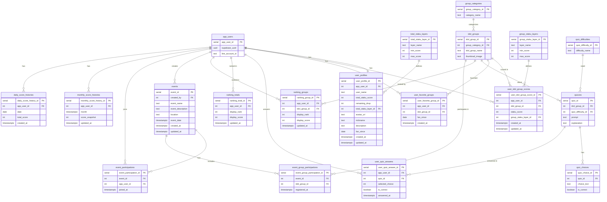

# K-Drop ER Diagram (v1 スキーマ)

```mermaid
erDiagram
    app_users {
        serial app_user_id PK
        uuid supabase_uuid
        text line_account_id
    }

    user_profiles {
        serial user_profile_id PK
        int app_user_id FK
        text user_name
        int total_otaku_score
        int remaining_drop
        int total_otaku_layer_id FK
        text avatar_url
        text nickname
        text description
        date fan_since
        timestamptz created_at
        timestamptz updated_at
    }

    total_otaku_layers {
        serial total_otaku_layer_id PK
        text layer_name
        int min_score
        int max_score
    }

    group_categories {
        serial group_category_id PK
        text category_name
    }

    idol_groups {
        serial idol_group_id PK
        int group_category_id FK
        text idol_group_name
        text thumbnail_image
    }

    group_otaku_layers {
        serial group_otaku_layer_id PK
        text layer_name
        int min_score
        int max_score
    }

    user_idol_group_scores {
        serial user_idol_group_score_id PK
        int app_user_id FK
        int idol_group_id FK
        int otaku_score
        int group_otaku_layer_id FK
        timestamptz created_at
        timestamptz updated_at
    }

    user_favorite_groups {
        serial user_favorite_group_id PK
        int app_user_id FK
        int idol_group_id FK
        date fan_since
        timestamptz created_at
    }

    quiz_difficulties {
        serial quiz_difficulty_id PK
        text difficulty_name
    }

    quizzes {
        serial quiz_id PK
        int idol_group_id FK
        int quiz_difficulty_id FK
        text prompt
        text explanation
    }

    quiz_choices {
        serial quiz_choice_id PK
        int quiz_id FK
        text choice_text
        boolean is_correct
    }

    user_quiz_answers {
        serial user_quiz_answer_id PK
        int app_user_id FK
        int quiz_id FK
        int selected_choice
        boolean is_correct
        timestamptz answered_at
    }

    ranking_totals {
        serial ranking_total_id PK
        int app_user_id FK
        int display_rank
        int display_score
        timestamptz updated_at
    }

    ranking_groups {
        serial ranking_group_id PK
        int app_user_id FK
        int idol_group_id FK
        int display_rank
        int display_score
        timestamptz updated_at
    }

    events {
        serial event_id PK
        int created_by FK
        text event_name
        text event_description
        text location
        timestamptz event_date
        timestamptz created_at
        timestamptz updated_at
    }

    event_participations {
        serial event_participation_id PK
        int event_id FK
        int app_user_id FK
        timestamptz joined_at
    }

    event_group_participations {
        serial event_group_participation_id PK
        int event_id FK
        int idol_group_id FK
        timestamptz registered_at
    }

    monthly_score_histories {
        serial monthly_score_history_id PK
        int app_user_id FK
        timestamptz month
        int score_snapshot
        timestamptz updated_at
    }

    daily_score_histories {
        serial daily_score_history_id PK
        int app_user_id FK
        date date
        int total_score
        timestamptz created_at
    }

    app_users ||--|| user_profiles : "has"
    total_otaku_layers ||--o{ user_profiles : "defines"
    app_users ||--o{ user_idol_group_scores : "has"
    idol_groups ||--o{ user_idol_group_scores : "scored in"
    group_otaku_layers ||--o{ user_idol_group_scores : "defines"
    app_users ||--o{ user_favorite_groups : "has"
    idol_groups ||--o{ user_favorite_groups : "favorited"
    group_categories ||--o{ idol_groups : "categorizes"
    idol_groups ||--o{ quizzes : "about"
    quiz_difficulties ||--o{ quizzes : "rated"
    quizzes ||--o{ quiz_choices : "has"
    app_users ||--o{ user_quiz_answers : "answers"
    quizzes ||--o{ user_quiz_answers : "answered in"
    app_users ||--o{ ranking_totals : "ranked in"
    app_users ||--o{ ranking_groups : "ranked in"
    idol_groups ||--o{ ranking_groups : "ranked by"
    app_users ||--o{ events : "creates"
    events ||--o{ event_participations : "has"
    app_users ||--o{ event_participations : "joins"
    events ||--o{ event_group_participations : "includes"
    idol_groups ||--o{ event_group_participations : "participates in"
    app_users ||--o{ monthly_score_histories : "has"
    app_users ||--o{ daily_score_histories : "has"
```
