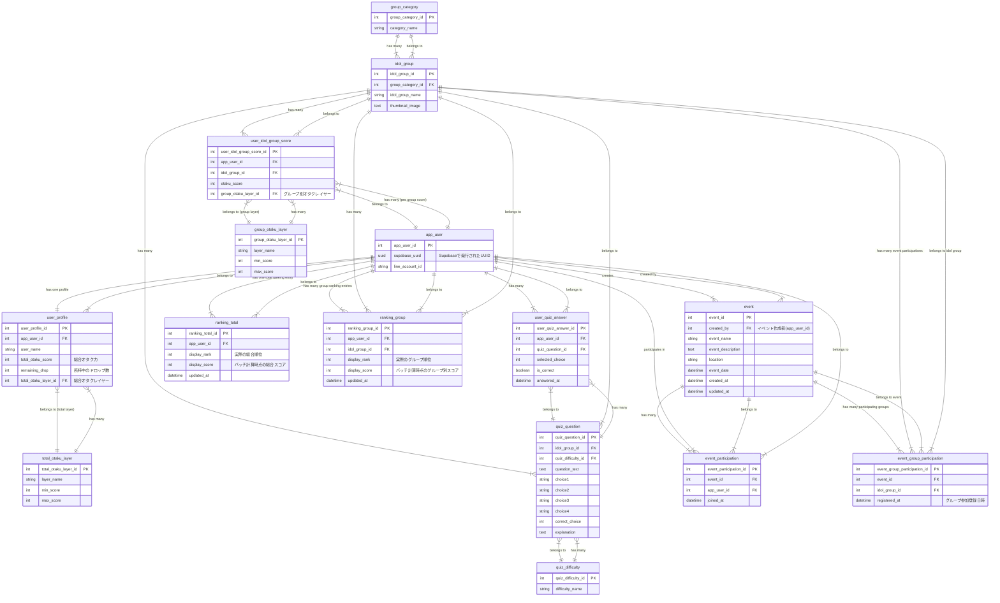

# データベーススキーマ

## エンティティ関連図

```mermaid
erDiagram
    group_category {
        int group_category_id PK
        string category_name
    }
    idol_group {
        int idol_group_id PK
        int group_category_id FK
        string idol_group_name
        text thumbnail_image
    }
    app_user {
        int app_user_id PK
        uuid supabase_uuid "Supabaseで発行されたUUID"
        string line_account_id
    }
    user_profile {
        int user_profile_id PK
        int app_user_id FK
        string user_name
        int total_otaku_score "総合オタク力"
        int remaining_drop "所持中のドロップ数"
        int total_otaku_layer_id FK "総合オタクレイヤー"
    }
    total_otaku_layer {
        int total_otaku_layer_id PK
        string layer_name
        int min_score
        int max_score
    }
    group_otaku_layer {
        int group_otaku_layer_id PK
        string layer_name
        int min_score
        int max_score
    }
    user_idol_group_score {
        int user_idol_group_score_id PK
        int app_user_id FK
        int idol_group_id FK
        int otaku_score
        int group_otaku_layer_id FK "グループ別オタクレイヤー"
    }
    quiz_difficulty {
        int quiz_difficulty_id PK
        string difficulty_name
    }
    quiz_question {
        int quiz_question_id PK
        int idol_group_id FK
        int quiz_difficulty_id FK
        text question_text
        string choice1
        string choice2
        string choice3
        string choice4
        int correct_choice
        text explanation
    }
    user_quiz_answer {
        int user_quiz_answer_id PK
        int app_user_id FK
        int quiz_question_id FK
        int selected_choice
        boolean is_correct
        datetime answered_at
    }
    ranking_total {
        int ranking_total_id PK
        int app_user_id FK
        int display_rank "実際の総合順位"
        int display_score "バッチ計算時点の総合スコア"
        datetime updated_at
    }
    ranking_group {
        int ranking_group_id PK
        int app_user_id FK
        int idol_group_id FK
        int display_rank "実際のグループ順位"
        int display_score "バッチ計算時点のグループ別スコア"
        datetime updated_at
    }
    event {
        int event_id PK
        int created_by FK "イベント作成者(app_user_id)"
        string event_name
        text event_description
        string location
        datetime event_date
        datetime created_at
        datetime updated_at
    }
    event_participation {
        int event_participation_id PK
        int event_id FK
        int app_user_id FK
        datetime joined_at
    }
    event_group_participation {
        int event_group_participation_id PK
        int event_id FK
        int idol_group_id FK
        datetime registered_at "グループ参加登録日時"
    }

    %% リレーション定義
    group_category ||--|{ idol_group : "has many"
    idol_group }|--|| group_category : "belongs to"

    app_user ||--|| user_profile : "has one profile"
    user_profile }|--|| app_user : "belongs to"

    user_profile }|--|| total_otaku_layer : "belongs to (total layer)"
    total_otaku_layer ||--|{ user_profile : "has many"

    app_user ||--|{ user_idol_group_score : "has many (per group score)"
    user_idol_group_score }|--|| app_user : "belongs to"
    idol_group ||--|{ user_idol_group_score : "has many"
    user_idol_group_score }|--|| idol_group : "belongs to"
    user_idol_group_score }|--|| group_otaku_layer : "belongs to (group layer)"
    group_otaku_layer ||--|{ user_idol_group_score : "has many"

    idol_group ||--|{ quiz_question : "has many"
    quiz_difficulty ||--|{ quiz_question : "has many"
    quiz_question }|--|| idol_group : "belongs to"
    quiz_question }|--|| quiz_difficulty : "belongs to"

    app_user ||--|{ user_quiz_answer : "has many"
    user_quiz_answer }|--|| app_user : "belongs to"
    quiz_question ||--|{ user_quiz_answer : "has many"
    user_quiz_answer }|--|| quiz_question : "belongs to"

    app_user ||--|{ ranking_total : "has one total ranking entry"
    ranking_total }|--|| app_user : "belongs to"

    app_user ||--|{ ranking_group : "has many group ranking entries"
    ranking_group }|--|| app_user : "belongs to"
    idol_group ||--|{ ranking_group : "has many"
    ranking_group }|--|| idol_group : "belongs to"

    app_user ||--|{ event : "creates"
    event }|--|| app_user : "created by"

    event ||--|{ event_participation : "has many"
    event_participation }|--|| event : "belongs to"
    app_user ||--|{ event_participation : "participates in"
    event_participation }|--|| app_user : "belongs to"

    event ||--|{ event_group_participation : "has many participating groups"
    event_group_participation }|--|| event : "belongs to event"
    idol_group ||--|{ event_group_participation : "has many event participations"
    event_group_participation }|--|| idol_group : "belongs to idol group"
```
