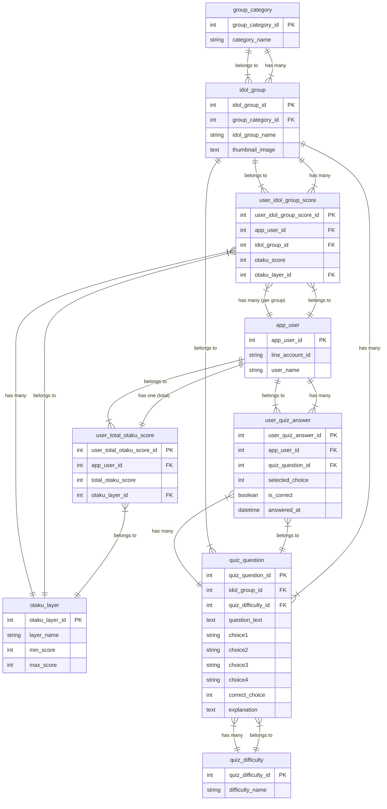

# データベーススキーマ

## エンティティ関連図

```mermaid
erDiagram
    group_category {
        int group_category_id PK
        string category_name
    }
    idol_group {
        int idol_group_id PK
        int group_category_id FK
        string idol_group_name
        text thumbnail_image
    }
    app_user {
        int app_user_id PK
        string line_account_id
        string user_name
    }
    otaku_layer {
        int otaku_layer_id PK
        string layer_name
        int min_score
        int max_score
    }
    user_total_otaku_score {
        int user_total_otaku_score_id PK
        int app_user_id FK
        int total_otaku_score
        int otaku_layer_id FK
    }
    user_idol_group_score {
        int user_idol_group_score_id PK
        int app_user_id FK
        int idol_group_id FK
        int otaku_score
        int otaku_layer_id FK
    }
    quiz_difficulty {
        int quiz_difficulty_id PK
        string difficulty_name
    }
    quiz_question {
        int quiz_question_id PK
        int idol_group_id FK
        int quiz_difficulty_id FK
        text question_text
        string choice1
        string choice2
        string choice3
        string choice4
        int correct_choice
        text explanation
    }
    user_quiz_answer {
        int user_quiz_answer_id PK
        int app_user_id FK
        int quiz_question_id FK
        int selected_choice
        boolean is_correct
        datetime answered_at
    }

    %% リレーション定義
    group_category ||--|{ idol_group : "has many"
    idol_group }|--|| group_category : "belongs to"

    app_user ||--|| user_total_otaku_score : "has one (total)"
    user_total_otaku_score }|--|| app_user : "belongs to"
    user_total_otaku_score }|--|| otaku_layer : "belongs to"

    app_user ||--|{ user_idol_group_score : "has many (per group)"
    idol_group ||--|{ user_idol_group_score : "has many"
    otaku_layer ||--|{ user_idol_group_score : "has many"
    user_idol_group_score }|--|| app_user : "belongs to"
    user_idol_group_score }|--|| idol_group : "belongs to"
    user_idol_group_score }|--|| otaku_layer : "belongs to"

    idol_group ||--|{ quiz_question : "has many"
    quiz_difficulty ||--|{ quiz_question : "has many"
    quiz_question }|--|| idol_group : "belongs to"
    quiz_question }|--|| quiz_difficulty : "belongs to"

    app_user ||--|{ user_quiz_answer : "has many"
    quiz_question ||--|{ user_quiz_answer : "has many"
    user_quiz_answer }|--|| app_user : "belongs to"
    user_quiz_answer }|--|| quiz_question : "belongs to"
```
