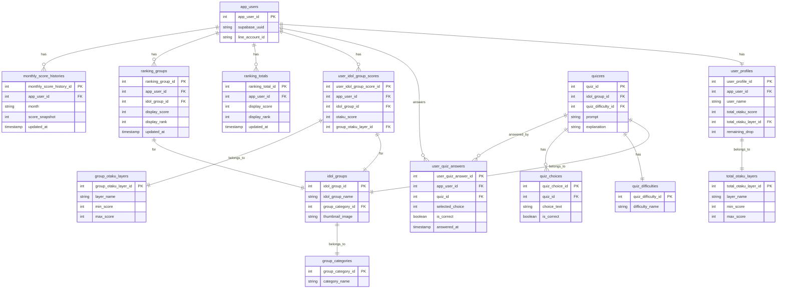

# Otaku Power (オタク力) ER Diagram

## Overview

This document describes the database schema for managing otaku power scores and quiz results in the K-Drop application.

## ER Diagram

## Data Flow When User Completes a Quiz

### 1. Quiz Answer Storage

When a user answers a quiz question:

1. A new record is created in `user_quiz_answers` with:
   - `app_user_id`: The user who answered
   - `quiz_id`: The quiz that was answered
   - `selected_choice`: The choice ID selected by the user
   - `is_correct`: Whether the answer was correct
   - `answered_at`: Timestamp of when the answer was submitted

### 2. Score Calculation and Updates

After completing a quiz session (multiple questions):

#### 2.1 Group-Specific Scores

- Update `user_idol_group_scores` for the relevant idol group
- Calculate new `otaku_score` based on correct/incorrect answers
- Update `group_otaku_layer_id` if score crosses layer thresholds

#### 2.2 Total Otaku Score

- Update `user_profiles.total_otaku_score` with the aggregate score
- Update `total_otaku_layer_id` if total score crosses layer boundaries

#### 2.3 Rankings Update

- Recalculate and update `ranking_totals` for overall ranking
- Recalculate and update `ranking_groups` for group-specific ranking
- Both include `display_score` and `display_rank` with timestamps

#### 2.4 Monthly History

- At the end of each month, create/update `monthly_score_histories`
- Store snapshot of current score for historical tracking

## Score Calculation Logic

### Points System

- Correct answer: +X points (varies by difficulty)
- Incorrect answer: 0 or -Y points (configurable)
- Difficulty multiplier from `quiz_difficulties` table

### Layer System

- Both total and group-specific layers define score ranges
- Users progress through layers as their scores increase
- Example layers: "初心者" (0-100), "中級者" (101-500), "上級者" (501+)

## Key Relationships

1. **User → Scores**: One user has one total score and multiple group scores
2. **Quiz → Answer**: Each quiz answer links a user, quiz, and their response
3. **Score → Layer**: Scores determine which layer/level a user belongs to
4. **Score → Ranking**: Scores determine user rankings both overall and per group
5. **Quiz → Group**: Each quiz belongs to a specific idol group for targeted scoring
